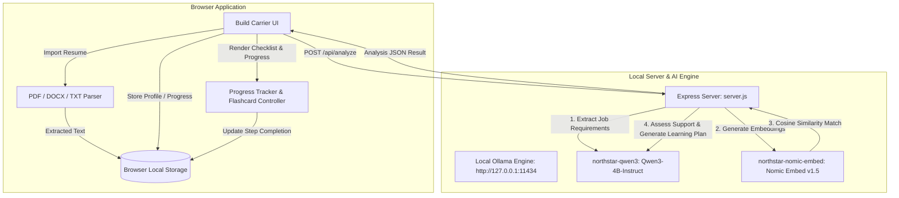

# Build Carrier

**Build Carrier** is a privacy-first, local AI résumé and career development workspace powered by local LLMs and embeddings. It compares job opportunities with evidence extracted from a candidate's profile and résumé, identifies skill gaps, and generates a personalized, trackable learning plan complete with practice-hour estimates and interactive flashcards.

---

## 🌟 Key Features

- **📄 Local Résumé Parsing**: Extracts text directly in the browser from PDF, DOCX, and TXT files without uploading documents to external servers.
- **🔒 Privacy-First Design**: All personal profiles, résumé text, saved opportunities, and progress tracking remain stored securely in your browser's local storage.
- **🤖 Local RAG & Model Inference**: Uses local Ollama models (`Qwen3-4B-Instruct` & `Nomic-Embed-Text v1.5`) via Express (`server.js`) for requirement extraction and semantic passage matching.
- **📊 Evidence Matching Ledger**: Compares required skills against profile data and résumé passages to highlight verified vs unsupported requirements.
- **🎯 Interactive Learning Plan & Progress Tracker**:
  - Interactive step checkboxes to check off completed milestones.
  - Live progress bars for each skill gap and overall learning goal completion.
  - Customizable weekly study-hour settings.
- **⚡ Flashcards Mode**: Interactive flashcard view allowing users to review target skills, practice action items, and track step completion card-by-card.

---

## 🏗️ System Architecture & Workflow



---

## 🤖 Local Models

| Purpose                                 | Model                  | Local Ollama Name       | Quantization |
| :-------------------------------------- | :--------------------- | :---------------------- | :----------- |
| **Requirement Extraction & Assessment** | Qwen3-4B-Instruct-2507 | `northstar-qwen3`       | Q4_K_M GGUF  |
| **Semantic Evidence Retrieval**         | Nomic Embed Text v1.5  | `northstar-nomic-embed` | Q4_K_M GGUF  |

---

## 🚀 Quick Start

### Prerequisites

- [Node.js](https://nodejs.org/) v20 or newer
- [Ollama](https://ollama.com/) running locally on `http://127.0.0.1:11434`
- ~3 GB disk space for quantized model weights

### 1. Installation & Model Download

```bash
# Install dependencies
npm install

# Download local GGUF weights and register models in Ollama
npm run models:download
```

### 2. Start Build Carrier

```bash
# Build frontend and start the unified server
npm run dev
# or
npm start
```

Open [http://127.0.0.1:3001/](http://127.0.0.1:3001/) in your browser.

---

## 🛠️ Useful Commands

```bash
# Build production bundle into dist/
npm run build

# Format codebase with Prettier
npm run format

# Download models to ~/.northstar/models
npm run models:download
```

---

## 📌 Architecture Documentation

For details on future multi-tenant scale-out, PostgreSQL/pgvector schemas, and deployment considerations, view [qualcomm_resume_rag_architecture.md](qualcomm_resume_rag_architecture.md).
