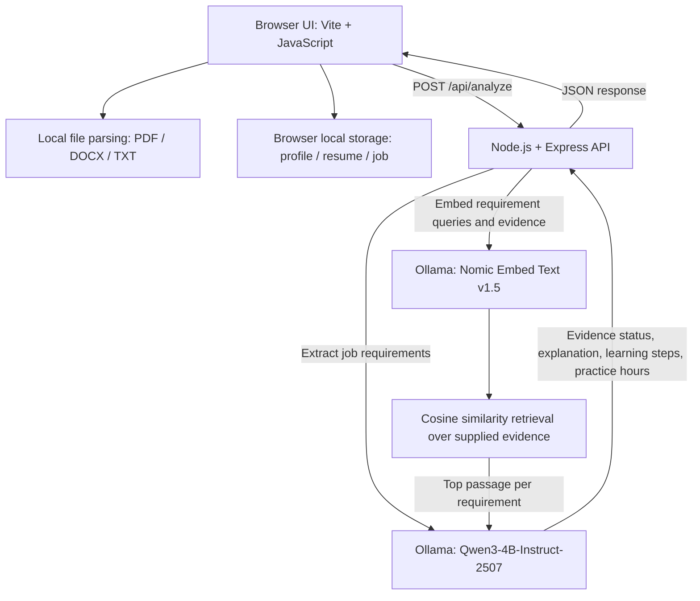

# BuildCarrers

BuildCarrers is a local-first résumé and job-fit workspace. It compares a job description with evidence from a user's profile and résumé, identifies skills not yet demonstrated, and creates a prioritized learning plan with approximate practice-hour estimates.

## What It Does

- Imports PDF, DOCX, and TXT résumés and extracts their text in the browser.
- Stores profile details, résumé text, job descriptions, and learning-plan settings in browser local storage.
- Uses Qwen3-4B-Instruct-2507 to extract job requirements and assess whether retrieved evidence supports them.
- Uses Nomic Embed Text v1.5 to retrieve relevant passages from the supplied profile and résumé.
- Creates three learning steps and an estimated number of focused practice hours for each unsupported requirement.
- Recalculates the sequential learning timeline from the user's selected study hours per week.

Practice-hour estimates are model-generated planning aids, not guarantees of proficiency or employment. Review the cited evidence and estimates yourself.

## Current Architecture



The API accepts the job description and relevant profile/résumé text for the current analysis request. It does not persist those requests or contact a hosted model. Profile and résumé data remain in the browser; Ollama runs on the same device.

The current prototype has no accounts, shared database, cloud sync, or multi-user storage. The uploaded résumé dataset is intentionally excluded from Git because it contains personal résumé information.

## Models

| Purpose                                    | Model                  | Local Ollama name       | Quantization |
| ------------------------------------------ | ---------------------- | ----------------------- | ------------ |
| Requirement extraction and evidence review | Qwen3-4B-Instruct-2507 | `northstar-qwen3`       | Q4_K_M GGUF  |
| Semantic evidence retrieval                | Nomic Embed Text v1.5  | `northstar-nomic-embed` | Q4_K_M GGUF  |

Model files are downloaded outside this repository to `%USERPROFILE%\.northstar\models` and imported into Ollama. They are not committed to Git.

## Run Locally

Requirements: Node.js 20 or newer, Ollama for Windows, and about 3 GB of disk space for the quantized model files.

1. Start the Ollama app and confirm its local service is running.
2. Install project dependencies with `npm install`.
3. Download and import the models with `npm run models:download`.
4. Start the API and frontend together with `npm run dev`.
5. Open [http://127.0.0.1:5173/](http://127.0.0.1:5173/).

The development API listens on `127.0.0.1:3001`; Vite proxies `/api` requests to it. For a production-style local run, use `npm start` to build the frontend and serve it from the Node process. Ollama must remain running in either mode.

## Useful Commands

```text
npm run build
npm run format
npx prettier --check index.html src/main.js src/style.css server.js vite.config.js scripts/download-models.js package.json README.md
```

## Architecture Notes

[qualcomm_resume_rag_architecture.md](qualcomm_resume_rag_architecture.md) documents the proposed longer-term architecture, including PostgreSQL/pgvector, authentication, and Qualcomm deployment options. Those components are not part of the current local prototype.
